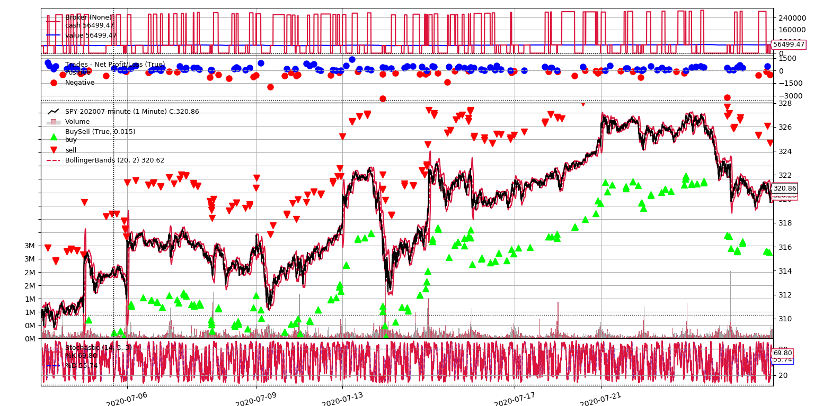

# Algorithmic Trading

## Project Overview
I have been interested in Algo Trading for some time, this is my first attempt using a common day trading strategy. 

The algorithm relies on two technical indicators, Bollinger Bands and the Stochastic Oscillator(Slow). 

Below are the steps to backtest the algorithm on your system.


## Setup
### Conda
Setup environment using the following commands:

```bash
conda env create -f environment.yml

conda activate backtrader
```

### API Keys
Pricing data for stocks is pulled from IEX Cloud, an API key can be acquired free [here](https://iexcloud.io/). A sandbox and a live key will be provided. During data pulling development, the sandbox key can be used, however, the data received will be scrambled, hence unsuitable for backtesting. 

FX pricing is pulled from Alpha Vantage, a free API key can be acquired [here](https://www.alphavantage.co/support/#api-key).

To set the API keys as environmental variables, use the following command:

```bash
conda env config vars set var=value
```

With var for the corrosponding API keys:
-   IEX Cloud = 'IEX_SECRET'
-   IEX Cloud Sandbox = 'IEX_SANDBOX'
-   Alpha Vantage = 'ALPHA_VANTAGE'

Once setting the keys, activate the env once again.

```bash
conda activate backtrader
```

Then to confirm the keys have been set correctly, use the following command.

```bash
conda env config vars list
```

## Pricing Data

Data for a majority of US Stocks and ETFs alongside some international symbols can be pulled using _iex_data.py_

The functions ```pull_day_minute``` and ```pull_month_minute``` can be used to pull a single day or month worth of intraday data on a 1-minute timescale.

Instructions for each function are provided with docstrings. The data is returned by the function as a dataframe by default, however, using _store=True_ will output a CSV file in the _/data_ folder (useful especially with monthly data).

_Warning - sandbox=True should only be used for debugging data pulling, the pricing produced is scrambled and completely useless for backtesting._

### Example 1
Intraday data for ticker __SPY__ for the month of July 2020. The true arg will create a CSV file with path: _data/SPY-202007-minute.csv_

```python
pull_month_minute('SPY',202007,True)
```
### Example 2
Intraday data for ticker __TSLA__ for 12th March 2020. Store will default to false and the function will return a dataframe.

```python
data = pull_day_minute('TSLA',20200312)
```

## Strategy

### Long
The algorithm waits for two conditions before opening a long position:

1. The previous bar closed below the lower Bollinger Band.
2. The current %K is in an oversold state (below 0.2).

Once these conditions are met, the algorithm will open a position and hold until the following condition is met:

1. The previous bar closes above the upper Bollinger Band.

### Short
For a short position, the opposite is required:

1. The previous bar closed above the upper Bollinger Band.
2. The current %K is in an overbought state (above 0.8).

And will be held until:
1. The previous bar closes below the lower Bollinger Band.

### Perameters

_Bollinger Bands_ - 80/20 (Upper/Lower), SD 2, Period 20

_Stochastic Oscilator_ - Period 14, dFast 3, dSlow 3 

_Leverage_ - 4x ([Alpaca.Markets](https://alpaca.markets/docs/trading-on-alpaca/margin-and-shorting/))

_Commision_ - 0 ([Alpaca.Markets](https://alpaca.markets/algotrading/))

_Cash_ - $50,000 (Ensure above PDT Spec)

## Backtesting

Once data has been pulled, the strategy can be backtested over the desired period.

Use the function ```runstrat``` with the CSV path string as the argument.

Backtesting is handled by the backtrader library, documentation can be found [here](https://www.backtrader.com/docu/).

By default a plot will be produced, this can be prevented by not calling ```cerebro.plot()``` in ```runstrat```.

### Example 1
The following call will backtest the ticker __SPY__ over the month of July 2020.

```python
runstrat('./data/SPY-202007-minute.csv')
```
## Performance

For the month of July 2020, the algorithm produced returns of $6,499.47 from an initial balance of $50,000, this equates to a 13.0% return.

A plot of the statergy's performace can be seen below:

